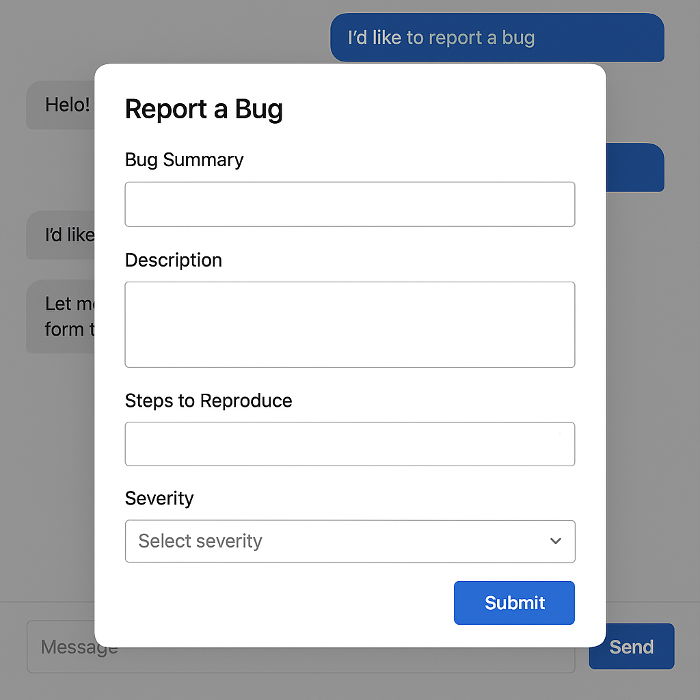
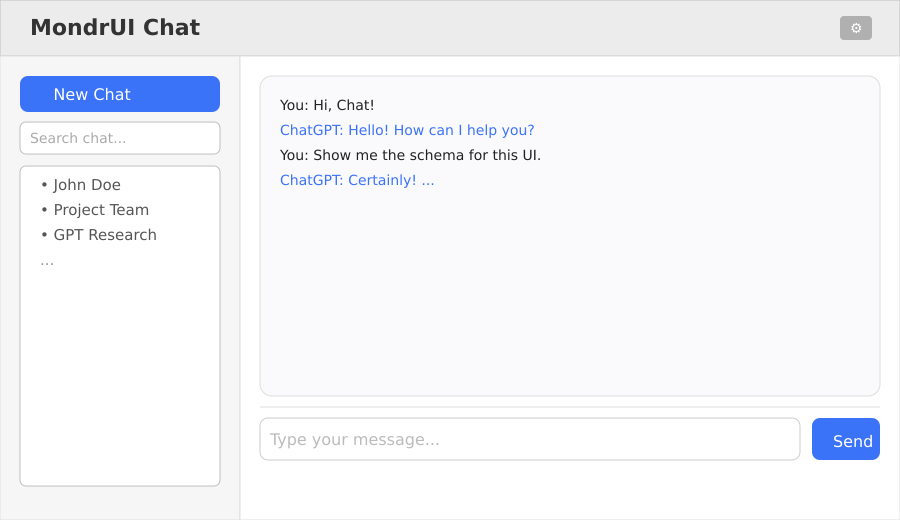

# MondrUI: A Specification for Conversational UI

## Letting the AI Drive the Interface

## Introduction

The term *Conversational UI* is often misunderstood. For many, it simply evokes a chatbot that exchanges text with users. But a truly conversational UI goes far beyond basic dialogue. It involves an interface whose **structure and behavior are determined dynamically by the AI**—in real time, and in response to user intent and context. This creates a fluid and adaptive experience, where the boundary between “conversation” and “interface” dissolves.

|  | In this article we want to present MondrUI as an implementation of this compositional UI—bridging the gap between intent and interface, and letting the conversation itself shape the experience. |
| :---- | :---- |

## Not Just Chatbots, Not Just Forms

Let’s be clear: conversational UI is **not** about generating raw HTML or JavaScript, nor is it about cobbling together rigid, pre-programmed components. Instead, it is about defining a **contract** between the AI and the rendering layer. This contract is typically implemented as a **Domain-Specific Language (DSL)** or high-level API. The AI uses the DSL to describe *what* should be rendered; the UI layer takes care of *how* to render it.

### **Why is This a Paradigm Shift?**

Traditional UI systems are static, menu-driven, or rely on developer-specified flows. In contrast, MondrUI allows the AI to *assemble* the UI from composable parts—widgets, forms, lists, layouts—at runtime, based on conversational context and user intent. This allows for seamless transitions between unstructured conversation and structured workflows, such as reporting a bug, uploading a document, or exploring data, all without the need for pre-programmed screens.

## A Layered Architecture

This approach enforces clear architectural separation:

* **AI Agent:** Interprets user intent and translates it into structured instructions.

* **DSL Interface:** Provides a limited, controlled vocabulary for the AI to express UI decisions in a declarative way.

* **UI Rendering Engine:** Receives these instructions and renders the interactive interface accordingly, using a registry of reusable components.

## By enforcing this separation, we gain **flexibility, safety, and reusability**. The AI never writes imperative code. It simply emits structured, declarative specifications, while the rendering engine ensures consistency and compliance with organizational standards.

## Ensuring Consistency: Templates and Rules

While this model allows great flexibility, real-world applications require a consistent user experience. MondrUI achieves this in two ways:

### **Templates in the DSL**

Templates are named blueprints—predefined sets of fields, layouts, and styling—that guarantee repeatability. For example, a `bugReportForm` template always includes a summary field, description, steps to reproduce, and severity selector, with consistent ordering and style. When the AI wants to present this form, it simply refers to the template, ensuring the UI always looks and behaves the same way for that function.

For example, the following json:

```json
{  
  "type": "ui.render",  
  "component": "bugReportForm",  
  "props": {  
    "title": "Report a Bug",  
    "fields": [  
      { "id":"summary", "label":"Bug Summary", "type":"text", "required":true },  
      { "id":"description", "label":"Description", "type":"textarea", "required":true },  
      { "id":"steps", "label":"Steps to Reproduce", "type":"textarea", "required":false },  
      { "id":"severity", "label":"Severity", "type":"select", "options":["Low","Medium","High","Critical"], "required":true }  
    ],  
    "actions": [  
      { "id":"submit", "label":"Submit", "type":"submit", "target":"bug.report" },  
      { "id":"cancel", "label":"Cancel", "type":"cancel", "target":"chat.resume" }  
    ]  
  }  
}
```


Would result in the display of this form: 



### **Rules and Restrictions**

Beyond templates, *rules* ensure the AI’s instructions always conform to business requirements and brand guidelines. Examples include:

*  **Field order:** Enforce a specific sequence of inputs (e.g., summary before description).

* **Validation constraints:** Make fields required, or restrict allowed values (e.g., “severity” must be one of four values).

*  **Theming and styling:** Ensure every form, button, or dialog fits the organization’s visual identity.

## These rules are enforced by the rendering engine, ensuring even dynamically constructed forms remain consistent and compliant.

## Contextual Assembly: From Intent to UI

MondrUI does not simply define static screens. Instead, it enables the dynamic *assembly* of visual interfaces by the AI, drawing from a registry of composable widgets (buttons, lists, containers, forms, etc.). The AI, guided by user intent and system state, decides which components to instantiate, with what data and configuration, and how to connect them into a coherent interface.

**For example:** If the user says, "I'd like to report a bug," the AI can instantly emit a DSL instruction invoking the `bugReportForm` template. The rendering engine overlays the modal bug report form directly atop the ongoing chat. After submission or cancellation, the conversation resumes, context preserved.

## Beyond the Example: Compositional Power

A key advantage of MondrUI’s approach is **compositionality**. Developers (or even the AI) can describe full applications—such as a ChatGPT-style interface, analytics dashboard, or support workflow—entirely in the DSL. Each interface is a tree of containers and widgets, assembled to suit the user’s journey in real time.

This also enables **multi-modal UIs**: conversational threads, sidebar navigation, action menus, search inputs, and dynamically updating lists—all specified as declarative components, all coordinated by AI-driven logic.

## Implications and Benefits

This pattern enables a truly **adaptive, intent-driven user experience**:

*  **Modularity:** UIs are composed from reusable primitives, but always consistently.

*  **Adaptivity:** The interface evolves based on user interaction and system state, not pre-defined menus.

* **Seamless UX:** Forms and workflows emerge organically from conversation.

* **Decoupled Logic:** AI and UI can evolve independently—each can be improved without risk to the other.

* **Governance:** Templates and rules enable compliance, auditability, and design consistency.

Conversational UI is not just about making chatbots smarter—it’s about merging the flexibility of natural language with the precision of structured interfaces, without sacrificing control or consistency. The result is a more intelligent, user-centric interaction paradigm.


## From Forms to Tools—and Beyond: The Next Phase of MondrUI

With the initial prototype of MondrUI, as documented in this repository, we have demonstrated a baseline for dynamically defined forms. The system supports both pre-registered and AI-generated form definitions, enabling structured, conversational data collection. The prototype is intended to show that AI-driven UI generation can move beyond static web forms and adapt in real time to user intent and context.

This is only an initial step. The next area for experimentation is action: moving from data entry to dynamic operations, mediated by the AI.

### Tool Integration: Making UIs Actionable

To move beyond forms, the next logical step for MondrUI is to enable simple actions—integrating *tools* that can be invoked by the AI and surfaced as interactive UI elements.

There are two principal experimental directions:

1. **MCP (Model Context Protocol) Tooling**:
   By connecting to MCP-compatible components, MondrUI could expose various tools that represent semantically rich operations. Using knowledge of each tool's schema, the AI could dynamically generate appropriate forms for tool input and present results, all within the same conversational context.

2. **Direct API Integration**:
   Where MCP is not an option, MondrUI could integrate with direct APIs (for example, those with OpenAPI schemas). The same mechanism would apply: the AI translates API contracts into simple, actionable UI components.

This design approach allows MondrUI to serve as a proving ground for the automated generation of UI over a growing set of tools—testing the feasibility of dynamic interface generation for more than just data collection.

### Flows: Orchestrating Cognitive Processes

Once the prototype can invoke tools, the next technical milestone is *flow composition*. Here, a flow means a sequence or graph of actions, orchestrated in response to a user's intent.

For example:
A user expresses, “I want to report a bug.”

* The AI, using MondrUI, generates a form for the relevant bug tracker (e.g., JIRA).
* On submission, MondrUI invokes the relevant API or tool to create the ticket.
* The AI might prompt for additional steps, such as attaching files or notifying others.

These flows are not statically programmed—they can be composed dynamically, based on what tools and schemas are available. The experiment is to see how far this approach can go in practice.

### Where We Are—and What Comes Next

* **Current State:**
  The repository contains a working demonstration of dynamic form generation and basic conversational UI. The infrastructure for pluggable schemas and data-driven forms is in place, with limited scope.

* **Next Steps:**

  1. **Tool Layer:** Prototype integration of MCP-compatible or OpenAPI-described tools, defining contracts for tool schemas and building adapters to invoke tool logic.
  2. **Dynamic UI over Tools:** Extend current logic to cover tool invocation, so the AI can generate actionable interfaces, not just static forms.
  3. **Flow Composition:** Prototype a minimal flow engine to let the AI sequence tools and forms into basic workflows, experimenting with orchestration and feedback.

MondrUI remains a research and prototyping area. Its purpose is to test concepts and technical feasibility—serving as a foundation for future, more robust implementations elsewhere. The next phase will focus on connecting data entry, tool invocation, and simple process flows, and learning from the results.


## Appendix: Complete MondrUI Schema Example

Below is a full **MondrUI DSL example** describing a ChatGPT-like conversational UI, including a sidebar with new chat button, search input, and a conversation list, alongside the main chat area.

## For example, the following json:


```json
{  
  "type": "ui.render",  
  "component": "Container",  
  "props": {  
    "direction": "vertical",  
    "children": [  
      {  
        "component": "Header",  
        "props": {  
          "title": "MondrUI Chat",  
          "actions": [  
            { "icon": "settings", "action": "openSettings" }  
          ]  
        }  
      },  
      {  
        "component": "Container",  
        "props": {  
          "direction": "horizontal",  
          "children": [  
            {  
              "component": "Sidebar",  
              "props": {  
                "direction": "vertical",  
                "width": "240px",  
                "children": [  
                  {  
                    "component": "Button",  
                    "props": {  
                      "label": "New Chat",  
                      "icon": "plus",  
                      "onClick": "startNewChat"  
                    }  
                  },  
                  {  
                    "component": "Input",  
                    "props": {  
                      "placeholder": "Search chat...",  
                      "onChange": "searchConversations"  
                    }  
                  },  
                  {  
                    "component": "List",  
                    "props": {  
                      "data": "@get_conversation_list",  
                      "itemComponent": "ConversationListItem",  
                      "emptyMessage": "No conversations found"  
                    }  
                  }  
                ]  
              }  
            },  
            {  
              "component": "Container",  
              "props": {  
                "direction": "vertical",  
                "grow": true,  
                "children": [  
                  {  
                    "component": "ChatHistory",  
                    "props": {  
                      "messages": "{{messages}}"  
                    }  
                  },  
                  {  
                    "component": "Divider",  
                    "props": { "margin": "md" }  
                  },  
                  {  
                    "component": "ChatInput",  
                    "props": {  
                      "onSend": "sendMessage",  
                      "placeholder": "Type your message..."  
                    }  
                  }  
                ]  
              }  
            }  
          ]  
        }  
      }  
    ]  
  }  
}
```


Would result in the display of this window:


